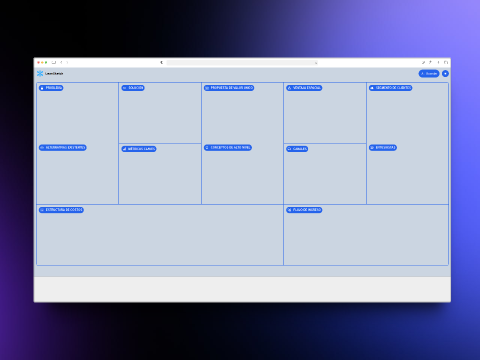

#  LeanSketch


## App



## Project structure

```
└── 📁css
    └── main.css
    └── tailwind.css
└── 📁js
    └── main.js
└── .gitignore
└── favicon.svg
└── index.html
└── package-lock.json
└── package.json
└── postcss.config.js
└── README.md
└── tailwind.config.js
```
